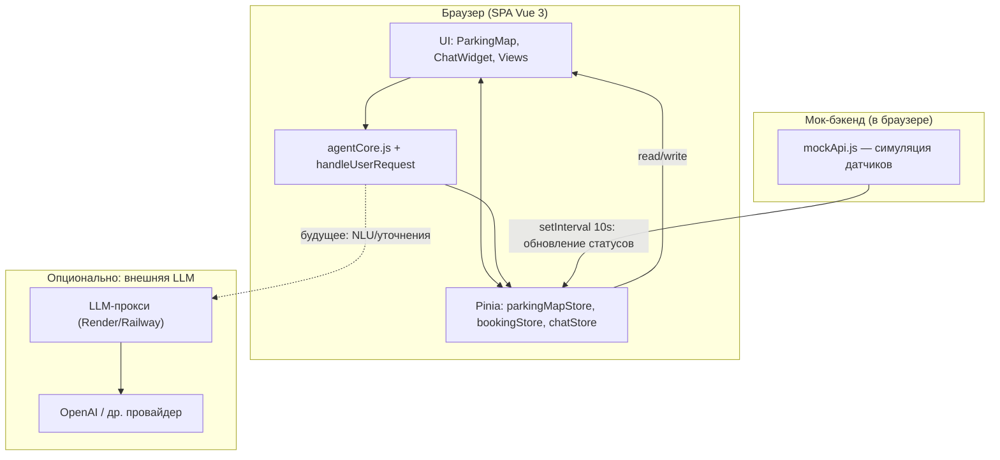
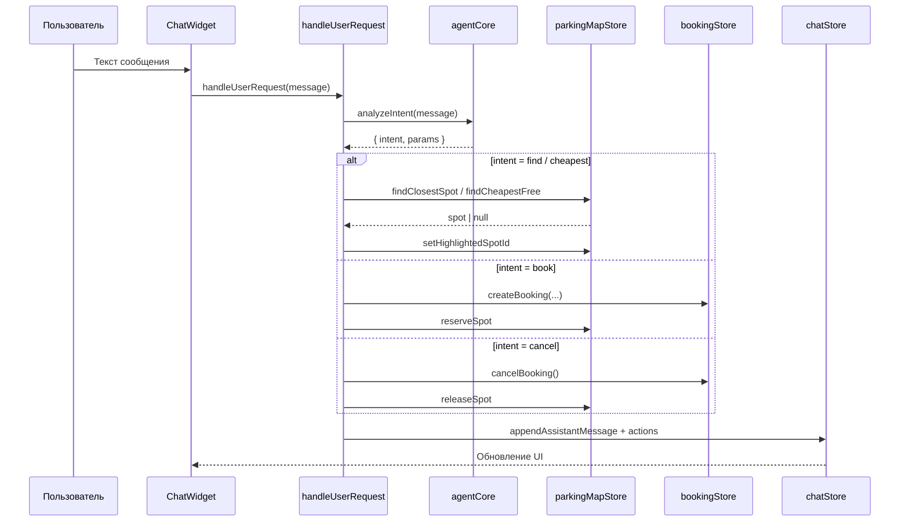

# Архитектура Smart Parking (ARCHITECTURE)

Ниже — диаграмма в формате Mermaid (требование задания: `ARCHITECTURE.md` с Mermaid).

## 1. Компоненты и потоки

## 2. Поток данных: запрос к ассистенту

## 3. Пояснения

- **Фронтенд** — единственный исполняемый UI; состояние централизовано в Pinia.
- **Мок** — имитация датчиков без реального IoT; в проде заменяется на WebSocket/REST.
- **LLM-прокси** — в учебном MVP намерения разбираются **на клиенте** (`agentCore.js`); прокси зарезервирован для расширений (сложный NLU, мультиязычность).

## 4. PNG

При необходимости экспорта в PNG: откройте диаграмму в [Mermaid Live Editor](https://mermaid.live) и сохраните как `ARCHITECTURE.png` в корень репозитория.
