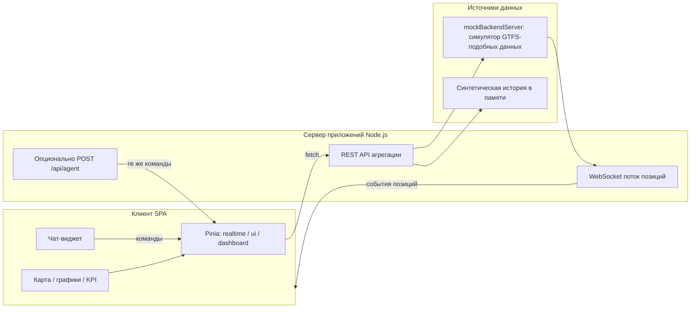
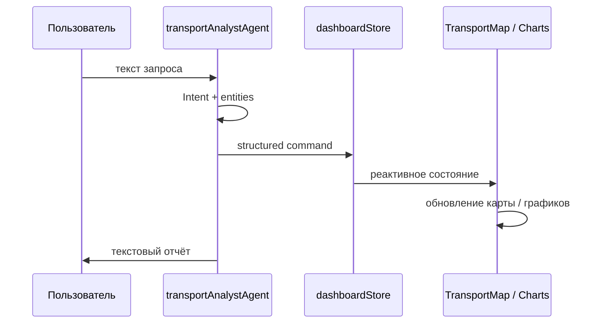

# Архитектура системы

## Компоненты

## Поток: чат → дашборд

## Связь бота и визуализации

1. Агент **не** рисует карту сам: он только эмитит команды (`UPDATE_MAP_FILTER`, `FETCH_AND_RENDER_CHART`, …).
2. Компоненты подписаны на **Pinia** (через `storeToRefs` / computed): изменение фильтра или набора данных вызывает точечное обновление.
3. Поток координат идёт мимо LLM: **realtimeStore** обновляется из WebSocket; агент лишь задаёт фильтры и запросы к истории.

## Ответ на вопрос блока 1 (кратко)

**Сложность:** нужно превратить свободный текст в **детерминированные команды состояния** и не смешивать это с потоком низкоуровневых координат — иначе визуализация будет деградировать при частых обновлениях.

**Связь модулей:** чат-агент пишет в **единый dashboard / ui store**; карта и графики только читают store и API. Так визуализация остаётся предсказуемой, а частые realtime-обновления не перезапускают разбор NLP.
